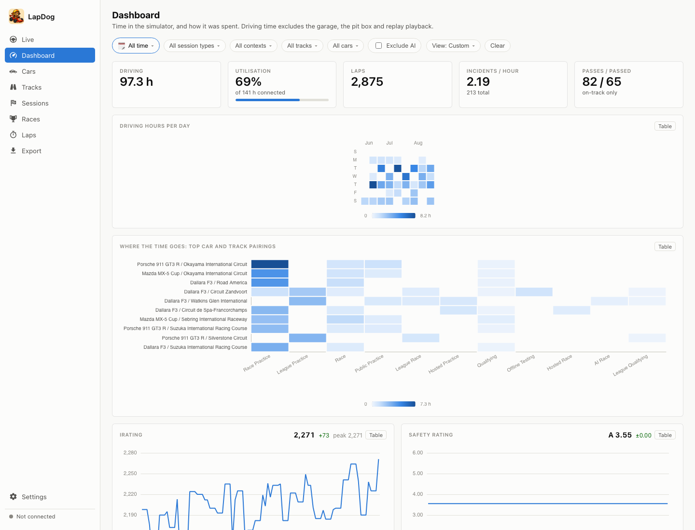
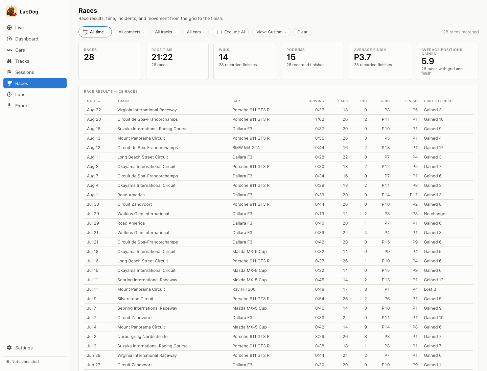
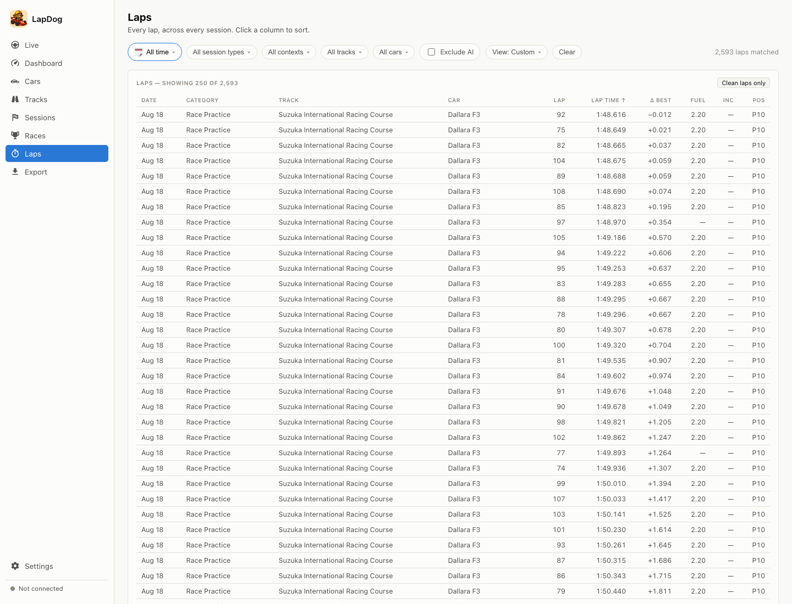

# LapDog

LapDog records how much time you actually spend in iRacing and what you spend
it on. It runs in the Windows system tray, reads iRacing telemetry once a
second, and keeps the result in a local database. Open the local web interface
to review driving time, laps, race results, incidents, position changes, and
rating history.

LapDog distinguishes public practice, race practice, qualifying, racing, time
trials, offline testing, hosted sessions, leagues, and AI sessions. Replay
playback is never counted as driving.

## Install

Download the latest `lapdog-<version>-setup.exe` from
[GitHub Releases](https://github.com/blezek/lapdog/releases/latest) and run it.
The installer is per-user and does not require administrator access. It can add
Start menu and desktop shortcuts and, by default, starts LapDog when you sign in
to Windows.

The installer stops a running copy of LapDog before an upgrade. If it cannot
stop the process, quit LapDog from its tray menu and choose **Retry**.

The release also includes `lapdog-<version>-portable.zip`. Extract it and run
`lapdog.exe` if you prefer not to install the application. The portable archive
also contains `lapdogctl.exe`, a console diagnostics tool.

Windows may show a SmartScreen warning because current releases are unsigned.
`SHA256SUMS` is published beside every release so downloads can be checked for
integrity.

## Start recording

1. Start LapDog before or after starting iRacing.
2. Look for the helmeted-dog icon in the Windows notification area.
3. Choose **Open LapDog** from the tray menu, or visit
   [http://127.0.0.1:47047](http://127.0.0.1:47047).
4. Join a session. The tray and the **Live** screen show when telemetry is being
   read and whether time is accumulating.

LapDog records automatically. There is no start/stop button for individual
sessions. Use **Pause recording** in the tray menu when you intentionally do not
want telemetry saved.

Three time counters describe each session:

- **Connected** — iRacing was publishing a session.
- **In car** — your driver was in the car rather than in the garage or menus.
- **Driving** — the car was actually moving under live control; pit-box time
  and replay playback are excluded.

Sessions shorter than the configured minimum are discarded. The default is 30
seconds and can be changed in **Settings**.

## The interface

Historical screens share one filter. Changing the date, session type, context,
track, car, or AI inclusion on one screen carries that selection to the other
historical screens. More than one car or track can be selected. Use the
**View** menu to save the current filter, reload a saved view, rename it, or
delete it.

### Dashboard

The overview combines driving time, utilisation, laps, incidents, passes, car
and track pairings, rating history, consistency, and race performance. Charts
can be switched to tables where a tabular view is useful.



### Races

Races are separated from the broader session list. Headline cards summarize
race time, wins, podiums, average finish, and positions gained. The sortable
table shows each race's duration, laps, incidents, grid position, finish, and
grid-to-finish movement.



### Laps

The lap table compares every recorded lap across sessions. Sort by date,
category, track, car, lap time, delta to the session best, fuel, incidents, or
position. **Clean laps only** hides pit and incident laps, and the shared filter
can narrow the comparison before sorting.



### Every screen

| Screen | What it shows |
|---|---|
| **Live** | Current connection, in-car and driving state; lap timing, speed, gear, fuel, incidents, and the time accumulated in the active session. When telemetry is absent or stale, it explains why it is not recording. |
| **Dashboard** | Totals and trends for the selected filter, including time distribution, car/track combinations, ratings, consistency, incidents, and race performance. |
| **Cars** | Time, laps, clean-lap consistency, incident rate, race results, pace trends, and track comparisons for one or more cars. |
| **Tracks** | The same analysis organized by track, with car comparisons and pace history for the selected circuit. |
| **Sessions** | A filterable session explorer. Select a session to inspect its three time counters, classification, result, laps, and recorded position changes. |
| **Races** | Race-only summaries and a sortable grid-to-finish results table. |
| **Laps** | A sortable, paged table of completed laps with lap time, delta, fuel, incidents, and position. |
| **Export** | CSV or JSON downloads of the currently filtered sessions, laps, or position changes. Empty values remain empty rather than being changed to zero. |
| **Settings** | Recording frequency, minimum session length, capture retention, units, theme, startup behavior, update checks, diagnostics, data paths, and collector status. |

## Tray menu

The tray icon includes a small status badge and the menu states the same status
in words:

- **Connected** — LapDog is reading iRacing.
- **Not connected** — no active simulator connection.
- **Paused** — telemetry is available, but recording is intentionally paused.

The menu opens the interface, pauses or resumes recording, opens the data
folder, shows available updates, and quits LapDog. During a session its tooltip
also shows the session, track, driving time, and completed laps.

## Settings and stored data

Settings save immediately unless the interface says a restart is required.
Choose metric or imperial units, light/dark/system theme, telemetry poll
interval, minimum session length, capture retention, interface port, and
whether LapDog starts with Windows.

All data stays on the local machine. The interface binds only to `127.0.0.1`,
so it is not reachable from another computer. Files are stored in:

```text
%LOCALAPPDATA%\lapdog
```

The folder contains `lapdog.db`, `config.json`, `lapdog.log`, saved telemetry
captures, and updater state. Captures can include your customer identifier and
the names and identifiers of other drivers in sessions you joined. Treat them
as private data. **Open data folder** in the tray menu opens the location.

Uninstalling preserves racing history by default. Select **Delete my racing
history** in the uninstaller only when you intend to remove the database,
settings, logs, and capture files permanently.

**Re-index saved captures** in Settings is a destructive debugging tool. It
deletes all stored sessions, laps, and position events, then rebuilds them from
captures that are still retained. History without a retained capture cannot be
recovered.

## Updates

Release builds check the stable GitHub Releases channel after startup and then
every 24 hours. An available update appears in the sidebar and tray. Installing
always requires consent. LapDog verifies the downloaded archive, waits for an
active recording or re-index to finish, replaces the executable, and restarts.

The updater changes `lapdog.exe` only. Portable users can instead download and
extract the new portable archive manually.

## Current limitations

- Recorded on-track captures replay with completed laps, driving time, race
  results, and position events. Continued Windows checks are still valuable as
  iRacing telemetry and session formats change.
- Real online sessions have produced rating observations. Offline placeholder
  ratings remain intentionally ignored.
- The automatic updater's full executable replacement and rollback path still
  needs its documented Windows fake-release exercise.
- Release executables are not Authenticode-signed.

## Development

Building, testing, architecture, capture replay, packaging, and release
instructions are in [DEVELOPMENT.md](DEVELOPMENT.md).
