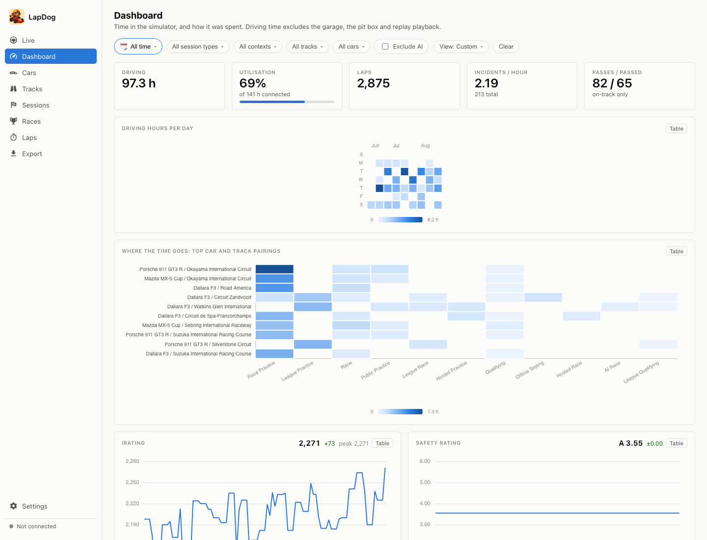
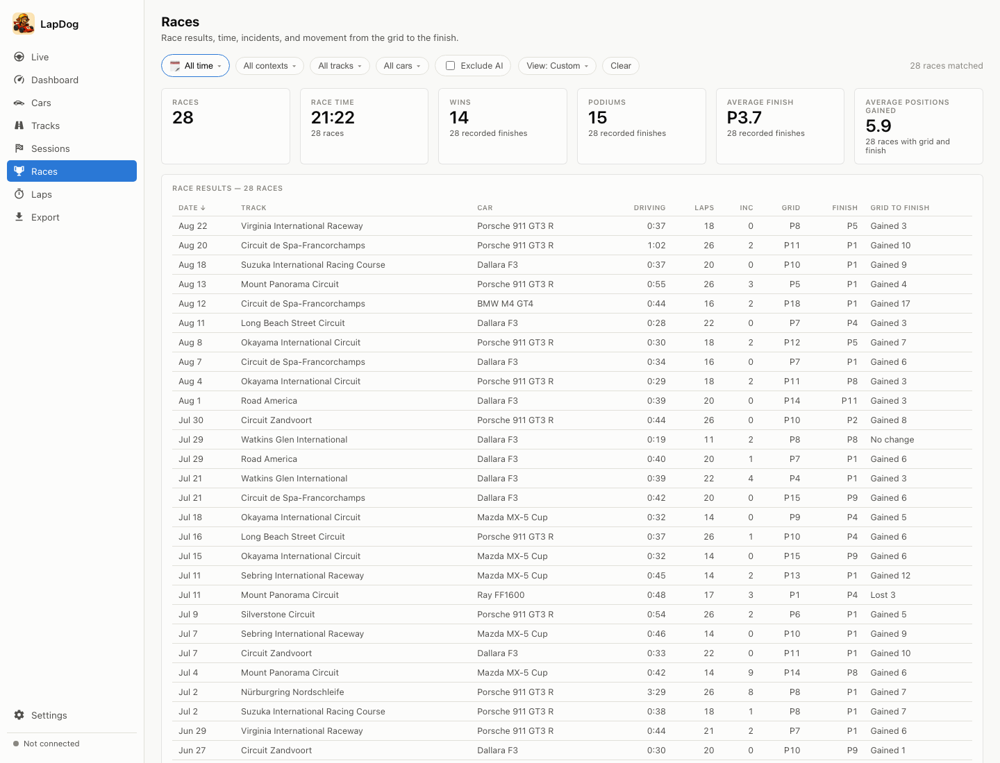
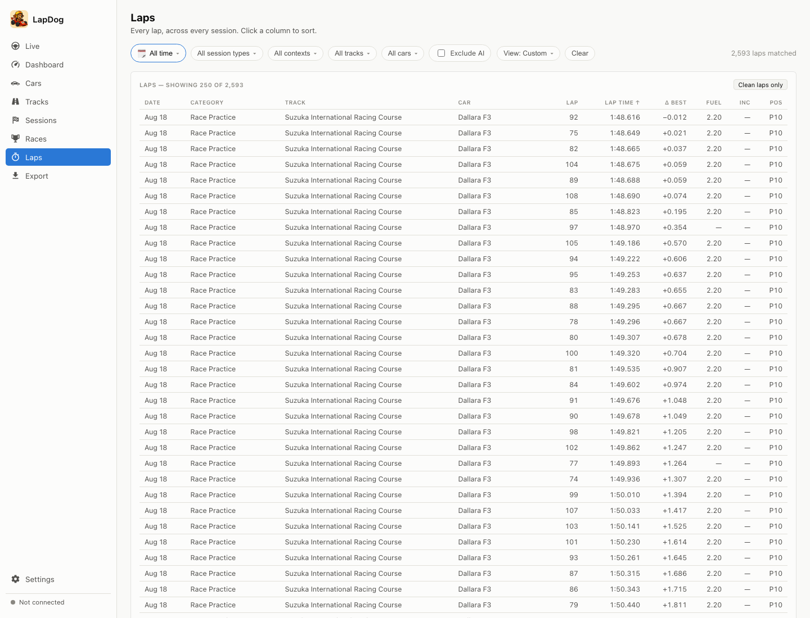

# LapDog

<p align="center">
  
</p>

<p align="center">
  <a href="https://github.com/blezek/lapdog/actions/workflows/ci.yml"></a>
  <a href="https://github.com/blezek/lapdog/releases/latest"></a>
  <a href="https://github.com/blezek/lapdog/releases"></a>
  <a href="go.mod"></a>
  
</p>

LapDog records how much time you actually spend in iRacing and what you spend
it on. It runs in the Windows system tray, reads iRacing telemetry once a
second, and keeps the result in a local database. Open the local web interface
to review driving time, laps, race results, incidents, position changes, and
rating history.

LapDog distinguishes public practice, race practice, qualifying, racing, time
trials, offline testing, hosted sessions, leagues, and AI sessions. Replay
playback is never counted as driving.

## Install

Download the latest `lapdog-<version>-setup.exe` from
[GitHub Releases](https://github.com/blezek/lapdog/releases/latest) and run it.
The installer is per-user and does not require administrator access. It can add
Start menu and desktop shortcuts and, by default, starts LapDog when you sign in
to Windows.

The installer stops a running copy of LapDog before an upgrade. If it cannot
stop the process, quit LapDog from its tray menu and choose **Retry**.

The release also includes `lapdog-<version>-portable.zip`. Extract it and run
`lapdog.exe` if you prefer not to install the application. The portable archive
also contains `lapdogctl.exe`, a console diagnostics tool.

Windows may show a SmartScreen warning because current releases are unsigned.
`SHA256SUMS` is published beside every release so downloads can be checked for
integrity.

## Start recording

1. Start LapDog before or after starting iRacing.
2. Look for the helmeted-dog icon in the Windows notification area.
3. Choose **Open LapDog** from the tray menu, or visit
   [http://127.0.0.1:47047](http://127.0.0.1:47047).
4. Join a session. The tray and the **Live** screen show when telemetry is being
   read and whether time is accumulating.

LapDog records automatically. There is no start/stop button for individual
sessions. Use **Pause recording** in the tray menu when you intentionally do not
want telemetry saved.

Three time counters describe each session:

- **Connected** — iRacing was publishing a session.
- **In car** — your driver was in the car rather than in the garage or menus.
- **Driving** — the car was actually moving under live control; pit-box time
  and replay playback are excluded.

Sessions shorter than the configured minimum are discarded. The default is 30
seconds and can be changed in **Settings**.

## The interface

Historical screens share one filter. Changing the date, session type, context,
track, car, or AI inclusion on one screen carries that selection to the other
historical screens. More than one car or track can be selected. Use the
**View** menu to save the current filter, reload a saved view, rename it, or
delete it.

### Dashboard

The overview combines driving time, utilisation, laps, incidents, passes, car
and track pairings, rating history, consistency, and race performance. Charts
can be switched to tables where a tabular view is useful.



### Top 10

The Top 10 screen ranks cars and tracks separately by completed laps, clean
laps, and distance driven. Each ranking is split by session category and can
be switched from its chart to an exact table. The shared historical filter
applies to all six rankings, and distance is shown in kilometres or miles
according to the unit selected in **Settings**.

### Races

Races are separated from the broader session list. Headline cards summarize
race time, wins, podiums, average finish, and positions gained. The sortable
table shows each race's duration, laps, incidents, grid position, finish, and
grid-to-finish movement.



### Laps

The lap table compares every recorded lap across sessions. Sort by date,
category, track, car, lap time, delta to the session best, fuel, incidents, or
position. **Clean laps only** hides pit and incident laps, and the shared filter
can narrow the comparison before sorting.



### Brake-It

Brake-It is a pedal-timing trainer inside LapDog at
`http://127.0.0.1:47047/brake-it`. It provides a keyboard simulator and reads
racing pedals exposed through the browser Gamepad API. The Devices screen shows
live raw axis values for any visible controller, detects pedals during guided
calibration, and lets the driver choose an axis when automatic detection picks
the wrong one. It samples released and held positions, then asks the driver to
press and verify each pedal separately before saving. The device list refreshes
when the tab gains focus and explains when gamepad access is blocked. The
simulator can switch between the keyboard and connected, calibrated controllers;
a run stops without saving if its controller disconnects. Device names can be
changed on the Devices screen. Controllers with the same browser name share a
calibration, so the driver chooses the intended live browser index for each
session. Mappings can be removed or detected again and are stored in LapDog's
SQLite database. Scenarios, completed runs, and their sampled
pedal traces are stored there too. Brake-It is currently an experimental feature
and is available only through its direct URL; it is not linked from LapDog's
navigation. Its routes, APIs, and stored data remain available while development
is unpublished.

The Simulator can hide the target traces while keeping the driver's recorded
brake and accelerator traces visible. Audio cues remain independently
selectable, and an optional large visual cue uses a stop sign for braking, a
pedal-release symbol for trail braking, a pause symbol for coasting, and a green
flag for acceleration. Braking-only practice ends after the trail-brake phase;
its saved result records that acceleration was omitted instead of reporting a
false zero accelerator-ramp error. Linked car and track selectors narrow the
practice-scenario list to real catalog combinations and explicitly mark an
unavailable pairing rather than silently changing the other selection. Custom
scenarios can assign or clear their car and track in the scenario editor, with
suggestions drawn from the local catalog.

The **Garage61** tab prepares scenarios directly in the running Go application.
Open `/brake-it/garage61` and enter a Garage61 access token. LapDog saves it in
`garage61-token` inside its data directory. The file is created with `0600`
permissions on platforms that use Unix file modes; Windows uses the data
directory's access controls. The token is not returned to the browser after
saving, stored in the database, or written to the log. It can be replaced or
removed in the tab without restarting LapDog. Alternatively, set
`GARAGE61_TOKEN` in the environment of
the process starting LapDog (or `lapdogctl serve`); a saved token takes
precedence over the environment variable. Choose an iRacing car and track
layout and click **Queue scenarios**. The picker lists Garage61's
available iRacing catalog; availability of usable laps depends on the token's
permissions. No Python installation or rebuild is needed. OAuth sign-in is not
implemented; the Go client accepts a separate token source so an OAuth token
manager can replace this temporary local-file flow later.

Recorded race and practice car/layout pairs appear as shortcuts in the Garage61
tab. Selecting one fills the car and track controls; it does not queue work.
Click **Queue scenarios** to request that combination, or **Queue refresh of all
saved combinations** to request a refresh. Requested work persists through
restarts and starts automatically, one combination at a time, when
either token source is available. Without a token, existing requests wait until
one is saved or LapDog restarts with `GARAGE61_TOKEN`. The tab shows waiting,
running, completed, and failed items; failed and unmatched items can be
retried. The current item shows progress and can be cancelled without losing
later items.

Processing runs one combination at a time, with progress and cancellation.
It uses the Python catalog model: up to 12 viewable laps, seven-sample smoothing,
4% braking-event threshold, 18% minimum peak, 1.8% lap-distance clustering,
and at least three distinct laps (or 35% of analyzed laps, whichever is greater)
per zone. Median timings and the peak-brake p10–p90 envelope define the targets.
As in Python, sample timing is estimated from lap time and sample count.
Requests are sequential with a one-second interval and Garage61 rate-limit
backoff. Processing stops after 30 minutes if it cannot finish.

Successful combinations appear under **Ready to practice** and in the Simulator's
car/track selectors. Targets and screened lap citations are saved atomically in
the local SQLite database and work offline. Reprocessing replaces the selected
combination's zones only after successful analysis; obsolete zones are retired
so existing run history keeps its references. Local targets take precedence over
bundled catalog imports, including after restart. Failed or cancelled analysis
keeps the previous scenarios. Raw CSV and driver identity are not saved.
Search fields narrow the Garage61 car and layout pickers. **Delete downloaded
scenarios** removes a prepared combination from the picker; check multiple rows
under **Ready to practice** and use **Delete selected** to remove them in one
transaction. Deletion clears their saved lap citations and keeps prior practice
results. A deletion
marker prevents packaged imports from silently restoring that combination.
Explicitly queueing it again removes the marker.

The Dashboard has a **Prepare a combination** link beside its car/track chart,
and its table links recorded race and practice pairings directly to Brake-It.
The Garage61 tab also lists every raced or practiced pairing from local LapDog
history, while its full picker covers all iRacing cars and layouts returned by
Garage61. A local weekly check highlights saved combinations whose last successful
preparation is at least seven days old. **Queue refresh of all saved combinations**
adds them to the processing queue, saving each successful result;
**Remind me in one week** hides the weekly reminder for seven days. Manual
refresh stays available under **Ready to practice**. The reminder check does not contact Garage61 or refresh
data on its own. If Garage61 supplies too few usable laps for an existing pairing,
its scenarios and citations remain available and the pairing is flagged for review.
An inaccessible or ambiguous catalog pairing is reported without changing its
scenarios. These controls support periodic review; they do not by themselves
establish a retention or erasure policy for Garage61 source data.

The Python scripts below remain available for generating developer build-time
catalogs and as the reference for the synthetic Go parity test.

The baseline scenario in a clean checkout is synthetic. An approved local
Garage61 import also stages its privacy-screened catalog as a Go embed input,
so subsequent LapDog builds include those read-only scenarios and reconcile
them into each database when it opens. The generated catalog remains ignored
by Git.

For an approved local Garage61 import, set the dedicated token and run:

```bash
python3 -m pip install -r tools/brake-it/requirements.txt  # once, for colored logs
export GARAGE61_TOKEN=...
make brake-it                         # imports into .dataset.db
# or: make brake-it BRAKE_IT_DB=/path/to/lapdog.db
```

The active extraction resolves the Mazda MX-5 and BMW M4 GT3 (excluding the M4
GT3 Evo) at Circuito de Navarra's Speed Circuit, Road Atlanta's Full Course, and
Circuit de Spa-Francorchamps's Grand Prix Pits. It processes the six car/track
combinations sequentially, checkpoints each completed combination, averages
visible telemetry into braking scenarios, and imports them through LapDog's
SQLite store. The full reviewed [free iRacing road-track
list](docs/brake-it-free-road-tracks.md) remains documented for expanding the
included-content catalog after testing. LapDog
checks each returned lap for visible telemetry before requesting its CSV; it
does not use Garage61's Pro-only telemetry search filter. Lap searches use
12-lap pages, verify fastest-first ordering across at least three pages when
available, and stop after finding the fastest 12 telemetry-visible laps. All
Garage61 requests are sequential and start at least one second apart by
default; set `BRAKE_IT_REQUEST_INTERVAL=2` to use a more conservative interval.
The importer honors Garage61's `Retry-After` header on successful responses and
429s, also reads `retryAfterSeconds` from 429 bodies, and adds up to one second
of random jitter before the next request. Set `BRAKE_IT_RETRY_JITTER` to change
the jitter bound. It writes only a screened local staging catalog under
`ignore/brake-it/` and an ignored copy used as Go build input. The catalog keeps
each cited lap's Garage61 link, lap time, and braking-window contribution so the
Scenarios screen can show its provenance; tokens, raw CSV, Garage61 API URLs,
and driver identity are not stored. Each request reports
its HTTP status and elapsed time rounded to a
tenth of a second. Rich supplies colored output through Python's standard
logging API; the importer falls back to plain structured logs when Rich is not
installed. The Scenarios screen can filter the imported catalog by car and
track. As soon as a car/track combination has been analyzed, its screened
scenarios are fsynced to the staging catalog and installed with an atomic
rename. A later failure therefore cannot discard completed combinations. On a
subsequent run, the importer validates the checkpoint and skips lap and CSV
downloads when that car/track combination already has scenarios with retained
citations. Older link-free checkpoints are regenerated. Stable
scenario IDs are merged once, and SQLite imports update the existing rows.

### Every screen

| Screen | What it shows |
|---|---|
| **Live** | Current connection, in-car and driving state; lap timing, speed, gear, fuel, incidents, and the time accumulated in the active session. When telemetry is absent or stale, it explains why it is not recording. |
| **Dashboard** | Totals and trends for the selected filter, including time distribution, car/track combinations, ratings, consistency, incidents, and race performance. |
| **Cars** | Time, laps, clean-lap consistency, incident rate, race results, pace trends, and track comparisons for one or more cars. |
| **Tracks** | The same analysis organized by track, with car comparisons and pace history for the selected circuit. |
| **Sessions** | A filterable session explorer. Select a session to inspect its three time counters, classification, result, laps, and recorded position changes. |
| **Races** | Race-only summaries and a sortable grid-to-finish results table. |
| **Laps** | A sortable, paged table of completed laps with lap time, delta, fuel, incidents, and position. |
| **Top 10** | Filtered car and track rankings for completed laps, clean laps, and distance driven, split by session category. |
| **Export** | CSV or JSON downloads of the currently filtered sessions, laps, or position changes. Empty values remain empty rather than being changed to zero. |
| **Brake-It** | An unpublished experimental pedal-timing trainer with live target and input traces, scored results, keyboard simulation, and calibrated Gamepad API racing pedals. |
| **Settings** | Recording frequency, minimum session length, capture retention, units, theme, startup behavior, update checks, diagnostics, data paths, and collector status. |

## Tray menu

The tray icon includes a small status badge and the menu states the same status
in words:

- **Connected** — LapDog is reading iRacing.
- **Not connected** — no active simulator connection.
- **Paused** — telemetry is available, but recording is intentionally paused.

The menu opens the interface, pauses or resumes recording, opens the data
folder, shows available updates, and quits LapDog. During a session its tooltip
also shows the session, track, driving time, and completed laps.

## Settings and stored data

Settings save immediately unless the interface says a restart is required.
Choose metric or imperial units, light/dark/system theme, telemetry poll
interval, minimum session length, capture retention, interface port, and
whether LapDog starts with Windows.

All LapDog and Brake-It data stays on the local machine. The interface binds only to `127.0.0.1`,
so it is not reachable from another computer. Files are stored in:

```text
%LOCALAPPDATA%\lapdog
```

The folder contains `lapdog.db`, `config.json`, `lapdog.log`, saved telemetry
captures, and updater state. Captures can include your customer identifier and
the names and identifiers of other drivers in sessions you joined. Treat them
as private data. **Open data folder** in the tray menu opens the location.

Uninstalling preserves racing history by default. Select **Delete my racing
history** in the uninstaller only when you intend to remove the database,
settings, logs, and capture files permanently.

**Re-index saved captures** in Settings is a destructive debugging tool. It
deletes all stored sessions, laps, and position events, then rebuilds them from
captures that are still retained. History without a retained capture cannot be
recovered.

## Updates

Release builds check the stable GitHub Releases channel after startup and then
every 24 hours. An available update appears in the sidebar and tray. Installing
always requires consent: choose **Upgrade now**, **Ask me later**, or **Skip this
version**. While downloading, LapDog reports transferred bytes and percentage
when GitHub supplies the archive size, then reports verification separately. It
waits for an active recording or re-index to finish before replacing the
executable and restarting.

The updater changes `lapdog.exe` only. Portable users can instead download and
extract the new portable archive manually.

## Current limitations

- Recorded on-track captures replay with completed laps, driving time, race
  results, and position events. Continued Windows checks are still valuable as
  iRacing telemetry and session formats change.
- Real online sessions have produced rating observations. Offline placeholder
  ratings remain intentionally ignored.
- The automatic updater's full executable replacement and rollback path still
  needs its documented Windows fake-release exercise.
- Release executables are not Authenticode-signed.

## Development

Building, testing, architecture, capture replay, packaging, and release
instructions are in [DEVELOPMENT.md](DEVELOPMENT.md).

### Windows startup diagnostics

For a startup failure, build the dedicated diagnostic executable on the Mac and
copy `dist/lapdog-debug.exe` to Windows:

```bash
make build-windows-diagnostic
```

Then launch it directly from Command Prompt:

```bat
lapdog-debug.exe --debug
```

This build uses the Windows console subsystem, so Command Prompt waits for it and
panic output remains visible. It retains Go symbols, disables automatic updates,
and cannot embed or import a developer's ignored Garage61 catalog. The tray,
collector, database, and HTTP interface otherwise use the normal application
path. Use the tray's Quit command or Ctrl+C to stop it.

The regular GUI-subsystem executable also supports console diagnostics:

```bat
start "" /wait lapdog.exe --console --debug
```

`--console` attaches to the launching console, or opens one when launched without
an existing console. `start /wait` keeps Command Prompt waiting for the GUI
executable to finish. `--debug` enables detailed logging for this run without
changing saved settings. Structured logs go to
`%LOCALAPPDATA%\lapdog\lapdog.log`, including ordinary startup errors after the
log opens. Unhandled panics and runtime fatal errors also append to
`%LOCALAPPDATA%\lapdog\lapdog-crash.log`. Errors before the logs open print to
the attached console. These flags require a build containing the console
diagnostics change; older releases do not implement them.
